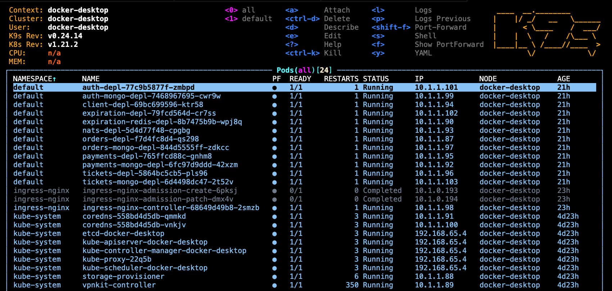
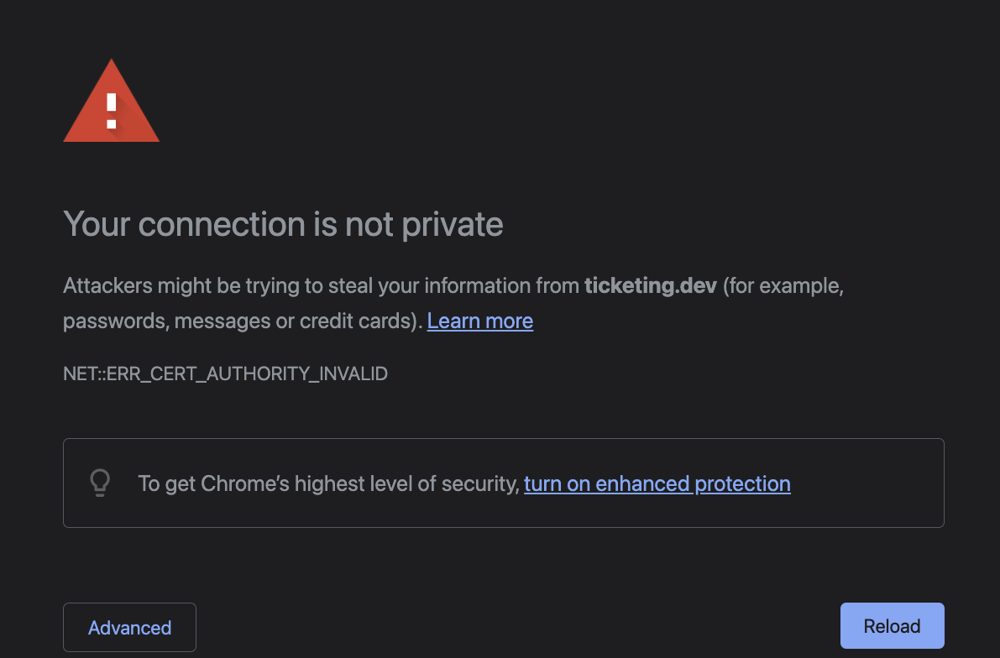
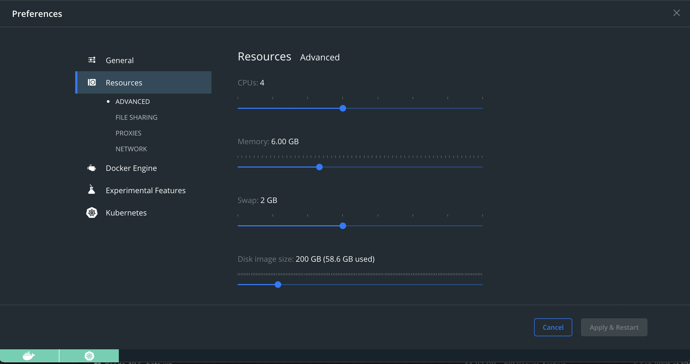

# Ticketing

### Stack: Javascript, Typescript, Node, Express, Next, React

### Env: Docker, Kubernetes, Skaffold

---

A Microservices app-template with NATS Streaming Server for a fully functional community ticket sales app. including

-   native auth
-   an SSR frontend with Next and React
-   CRUD tickets
-   CRUD orders
-   manage payments with Stripe
-   CI/CD

---

## A bit of Setup

### **Add ticketing.dev path to localhost**

```
code /etc/hosts
```

add to the end of the file

```
127.0.0.1 ticketing.dev
```

### **Create a secret keys for use as a local env variable in the deployment.yaml files for K8s**

#### **_JWT key:_**

substitute 'secretOrPrivateKey' with your own key:

```
kubectl create secret generic jwt-secret --from-literal=JWT_KEY=secretOrPrivateKey
```

now check

```
kubectl get secrets
```

#### **_Stripe API key:_**

get your Stripe API key from stripe.com

substitute 'yourStripeSecretKey' with your own key:

```
kubectl create secret generic stripe-secret --from-literal STRIPE_KEY=yourStripeSecretKey
```

now check

```
kubectl get secrets
```

#### **_For running K8s locally, ensure you have the Ingress-NGINX Loadbalancer installed_**

Install Ingress-NGINX Loadbalancer

```
kubectl apply -f https://raw.githubusercontent.com/kubernetes/ingress-nginx/controller-v0.48.1/deploy/static/provider/cloud/deploy.yaml
```

---

## Tools for running K8s

### **Check out K9s !!**

I found a great tool for monitoring your K8s cluster from your CLI with essentially ZERO config and setup:

https://github.com/derailed/k9s

```
brew install k9s
k9s
```

K9s screenshot:



---

## Run the App (client) locally

Since adding ticketing.dev to the /etc/hosts file, you can run the app in your browser (Chrome preferred) at ticketing.dev.

The Chrome browser is likely to respond to that request with a privacy warning and blocking that site:



To resolve this issue, just click anywhere on the browser screen and type **"thisisunsafe"** and you're good to go!

---

## **Reflections on Troubleshooting**

### **Deployments were failing with skaffold dev**

#### _My deployment.yaml files were missing a resource config for each container._

Here's the guide to fixing this:
[Managing Resources for Containers](https://kubernetes.io/docs/concepts/configuration/manage-resources-containers/)

This looked something like this:

```
resources:
    requests:
        cpu: '100m'
        memory: '100Mi'
    limits:
        cpu: '150m'
        memory: '150Mi'
```

#### _Then my pods were being evicted due to node-pressure_

...this was a tough one. At first I thought that too many pods were being deplyed at one time, so I added Pod prioritisation and scheduling:

[Pod Priority and Preemption](https://kubernetes.io/docs/concepts/scheduling-eviction/pod-priority-preemption/)

I added a scheduling.yaml with multiple priority schedules (see pod-schedule-priority-classes.yaml), whick looks something like this:

```
apiVersion: scheduling.k8s.io/v1
kind: PriorityClass
metadata:
    name: first-priority
value: 1000000
preemptionPolicy: PreemptLowerPriority
globalDefault: false
description: 'This is a first priority class.'
---
apiVersion: scheduling.k8s.io/v1
kind: PriorityClass
metadata:
    name: second-priority
value: 900000
preemptionPolicy: PreemptLowerPriority
globalDefault: false
description: 'This is a second priority class.'
...
```

Still that didn't fix the node pressure problem, so I further researched...

[K8s Taints & Tolerations](https://kubernetes.io/docs/concepts/scheduling-eviction/taint-and-toleration/) ; and

[K8s Node-pressure Eviction](https://kubernetes.io/docs/concepts/scheduling-eviction/node-pressure-eviction/)

...and added to my depyment.yaml files something like this:

```
priorityClassName: first-priority
            tolerations:
                - key: ''
                  operator: 'Exists'
                  effect: 'NoExecute'
                  tolerationSeconds: 120
```

Still no luck fixing the node-pressure problem.

**_FINALLY_** I found the culprit: it was the Docker preferences where I needed to tweak-up the Resource allowances for the environment :)

Docker Preferences -> Resources -> Advanced:



---

### **kubectl fix**

One of the errors running Skaffold has been:

> Error from server (InternalError): error when creating "STDIN": Internal error occurred: failed calling webhook "validate.nginx.ingress.
> kubernetes.io": Post "https://ingress-nginx-controller-admission.ingress-nginx.svc:443/networking/v1beta1/ingresses?timeout=10s": dial tcp 10.
> 104.45.154:443: connect: connection refused

I found this fix to remove the Validating Webhook entirely:

```
kubectl delete -A ValidatingWebhookConfiguration ingress-nginx-admission
```

For a more fine grain approach to the above, check the config:

```
kubectl get validatingwebhookconfigurations
```

then, deleted any specific configuration using

```
kubectl delete validatingwebhookconfigurations [configuration-name]
```

---

### **Kubernetes API reference**

[K8s API](https://kubernetes.io/docs/reference/generated/kubernetes-api/v1.21/#-strong-api-overview-strong-)
